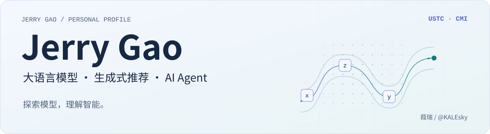

<picture>
  <source media="(prefers-color-scheme: dark) and (max-width: 600px)" srcset="assets/profile/hero-dark-compact.svg">
  <source media="(max-width: 600px)" srcset="assets/profile/hero-light-compact.svg">
  <source media="(prefers-color-scheme: dark)" srcset="assets/profile/hero-dark.svg">
  
</picture>

  <a href="#kale-about">关于我</a> &nbsp; / &nbsp;
  <a href="#kale-stack">技术栈</a> &nbsp; / &nbsp;
  <a href="#kale-learning">学习方向</a> &nbsp; / &nbsp;
  <a href="#kale-tools">AI 工具</a>

---

## 👨‍💻 关于我

### 🎓 教育经历

<table>
  <tr>
    <td width="620">
      <strong>本科｜哈尔滨工业大学</strong> 
      计算机科学与技术 
      工学学士 · 已毕业
    </td>
    <td width="220" align="right">
      <i>C9 · 985 · 211 · 双一流</i>
    </td>
  </tr>
  <tr>
    <td>
      <strong>硕士｜中国科学技术大学</strong> 
      计算机技术 
      专业硕士 · 在读
    </td>
    <td align="right">
      <i>华五 · C9 · 985 · 211 · 双一流</i>
    </td>
  </tr>
</table>

### 🔬 科研经历

**中国科学技术大学 · 跨媒体智能课题组（USTC-CMI）**  
*Cross-Media Intelligence Group*

**导师**：张勇东教授  
**当前研究**：大模型生成式推荐（Generative Recommendation）

> 🎯 **主要兴趣**  
> 大语言模型算法 · 基础模型（Foundation Models）
>
> 🤖 **延伸兴趣**  
> AI Agent 的算法与研究

---

## 🛠️ 技术栈

**模型与算法**

  
  
  
  
  

**通用开发**

  
  
  
  
  
  

---

## 📚 学习方向

面向大模型算法与 Agent 研究，逐步补齐基础、推进实验。

### 🧠 大语言模型与基础模型

- **模型与预训练**  
  Transformer · Tokenization · 训练数据
- **微调与对齐**  
  SFT · LoRA / QLoRA · 偏好优化
- **强化学习与推理能力**  
  Reward Modeling · RLHF · Reasoning
- **训练、推理与评测**  
  分布式训练 · 推理机制 · 模型评测

  
展开更多学习关键词

- **预训练**：Causal Language Modeling · 数据质量与配比 · Scaling Laws
- **后训练**：DPO · PPO / GRPO · 奖励设计
- **推理能力**：Chain-of-Thought · Test-time Scaling
- **推理效率**：Decoding · KV Cache · Batching
- **评测**：Benchmark · LLM-as-a-Judge · 可复现实验

### 🤖 AI Agent 研究

- **推理与规划** · Agentic Reasoning / Planning
- **工具与交互** · Tool Use / Memory
- **学习与评测** · Agent Learning / Evaluation

---

## 🧰 AI 工具

日常用于辅助科研、编码与探索 Agent 工作流。

  
  
  

---

  ✨ 保持好奇，认真求证。 
  从一个问题出发，让理解在实验中生长。

